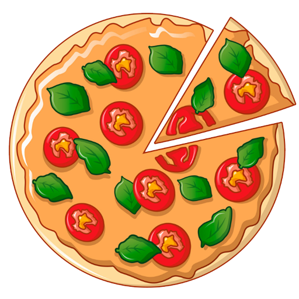
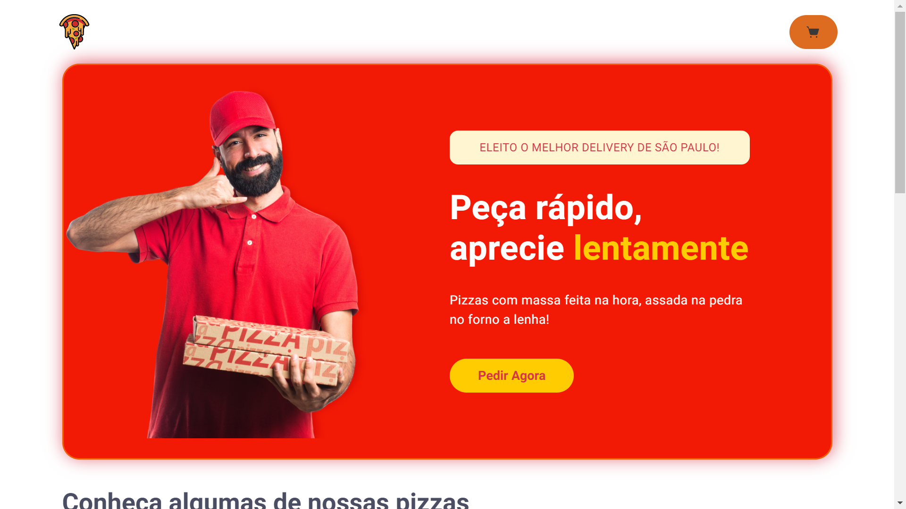

<p align="center">
  
</p>


## **💻** Projeto

Final de dia depois de um dia corrido, o máximo que queremos é uma pizza bem gostosa. Mas é só entrar em contato com qualquer pizzaria que já bate aquele desâmino: aquela página muito ruim, sem usabilidade e interação com o usuário. Pensando nisso, a fim consolidar ainda mais meus conhecimentos sendo alinhado com as novas e melhores práticas e tecnologias disponíveis no mundo da tecnologia, durante o final de semana enquanto esperava aquela pizza, desenvolvi uma aplicação Frontend “mobile first” de vendas de pizzas, onde o usuário pode fazer sua compra, e acompanhar todo o processo logístico da empresa. Foi criado utilizando ReactJS, NextJS, ChakraUI, Context API, etc.

<p align="center">
  
</p>


## Tecnologias utilizadas

- [Typescript](https://www.typescriptlang.org/)
- [ReactJS](https://pt-br.reactjs.org/)
- [ChakraUI](https://chakra-ui.com/)

## **🚀** Como Executar

Como o repositório e siga o passo a passo de cada stack.

```bash
## Clone o projeto em sua máquina
git clone https://github.com/srsouzaj/pizza10.client.web.git

# Acessar o projeto no terminal
$ cd pizza10.client.web

# Instalar as dependências
$ npm install

# Executar o servidor em modo de desenvolvimento
$ npm run dev
```

## 📝 License

Esse projeto está sob a licença MIT. Veja o arquivo [LICENSE](https://github.com/srsouzaj/pizza10.client.web/blob/main/LICENSE.md) para mais detalhes.

Feito com ❤️ por Jorge de Souza
